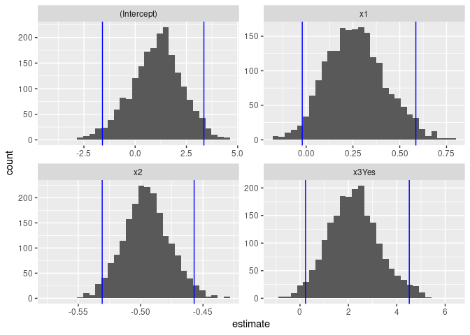

Activity 9 - Bootstrapping
================

``` r
library(tidyverse)
```

    ## ── Attaching packages ─────────────────────────────────────── tidyverse 1.3.2 ──
    ## ✔ ggplot2 3.3.6     ✔ purrr   0.3.4
    ## ✔ tibble  3.1.8     ✔ dplyr   1.0.9
    ## ✔ tidyr   1.2.0     ✔ stringr 1.4.1
    ## ✔ readr   2.1.2     ✔ forcats 0.5.2
    ## ── Conflicts ────────────────────────────────────────── tidyverse_conflicts() ──
    ## ✖ dplyr::filter() masks stats::filter()
    ## ✖ dplyr::lag()    masks stats::lag()

``` r
library(tidymodels)
```

    ## ── Attaching packages ────────────────────────────────────── tidymodels 1.0.0 ──
    ## ✔ broom        1.0.0     ✔ rsample      1.1.0
    ## ✔ dials        1.0.0     ✔ tune         1.0.0
    ## ✔ infer        1.0.3     ✔ workflows    1.0.0
    ## ✔ modeldata    1.0.0     ✔ workflowsets 1.0.0
    ## ✔ parsnip      1.0.1     ✔ yardstick    1.0.0
    ## ✔ recipes      1.0.1     
    ## ── Conflicts ───────────────────────────────────────── tidymodels_conflicts() ──
    ## ✖ scales::discard() masks purrr::discard()
    ## ✖ dplyr::filter()   masks stats::filter()
    ## ✖ recipes::fixed()  masks stringr::fixed()
    ## ✖ dplyr::lag()      masks stats::lag()
    ## ✖ yardstick::spec() masks readr::spec()
    ## ✖ recipes::step()   masks stats::step()
    ## • Use tidymodels_prefer() to resolve common conflicts.

``` r
# Create a data frame/tibble named sim_dat
sim_dat <- tibble(
# Explain what next line is doing
  x1 = runif(20, -5, 5),
# Explain what next line is doing
  x2 = runif(20, 0, 100),
# Explain what next line is doing
  x3 = rbinom(20, 1, 0.5)
  )

b0 <- 2
b1 <- 0.25
b2 <- -0.5
b3 <- 1
sigma <- 1.5

errors <- rnorm(20, 0, sigma)

sim_dat <- sim_dat %>% 
  mutate(
    y = b0 + b1*x1 + b2*x2 + b3*x3 + errors,
    x3 = case_when(
      x3 == 0 ~ "No",
      TRUE ~ "Yes"
      )
    )
```

``` r
mlr_fit <- linear_reg() %>%
  set_mode("regression") %>% 
  set_engine("lm") %>% 
  fit(y ~ x1 + x2 + x3, data = sim_dat)

# Also include the confidence intervals for our estimated slope parameters
tidy(mlr_fit, conf.int = TRUE)
```

    ## # A tibble: 4 × 7
    ##   term        estimate std.error statistic  p.value conf.low conf.high
    ##   <chr>          <dbl>     <dbl>     <dbl>    <dbl>    <dbl>     <dbl>
    ## 1 (Intercept)    1.12     0.973       1.15 2.68e- 1  -0.947      3.18 
    ## 2 x1             0.225    0.130       1.73 1.03e- 1  -0.0511     0.500
    ## 3 x2            -0.496    0.0152    -32.6  4.59e-16  -0.528     -0.464
    ## 4 x3Yes          2.16     0.835       2.59 1.98e- 2   0.391      3.93

``` r
# Set a random seed value so we can obtain the same "random" results
set.seed(631)

# Generate the 2000 bootstrap samples
boot_samps <- sim_dat %>% 
  bootstraps(times = 2000)

boot_samps
```

    ## # Bootstrap sampling 
    ## # A tibble: 2,000 × 2
    ##    splits          id           
    ##    <list>          <chr>        
    ##  1 <split [20/8]>  Bootstrap0001
    ##  2 <split [20/6]>  Bootstrap0002
    ##  3 <split [20/6]>  Bootstrap0003
    ##  4 <split [20/6]>  Bootstrap0004
    ##  5 <split [20/10]> Bootstrap0005
    ##  6 <split [20/10]> Bootstrap0006
    ##  7 <split [20/7]>  Bootstrap0007
    ##  8 <split [20/6]>  Bootstrap0008
    ##  9 <split [20/8]>  Bootstrap0009
    ## 10 <split [20/6]>  Bootstrap0010
    ## # … with 1,990 more rows

``` r
boot_samps$splits[[1]] %>% analysis()
```

    ## # A tibble: 20 × 4
    ##        x1    x2 x3         y
    ##     <dbl> <dbl> <chr>  <dbl>
    ##  1  0.945  3.13 Yes     3.22
    ##  2  1.87  58.9  No    -26.3 
    ##  3 -4.04  69.7  No    -34.5 
    ##  4 -3.13  45.8  No    -24.8 
    ##  5 -3.03  13.6  No     -3.91
    ##  6  1.71  52.0  No    -25.1 
    ##  7 -4.91  24.6  Yes   -12.0 
    ##  8  0.252 69.7  No    -32.8 
    ##  9  3.89  35.6  No    -15.2 
    ## 10 -2.13  64.7  No    -32.1 
    ## 11 -2.13  64.7  No    -32.1 
    ## 12  1.50  93.0  No    -43.3 
    ## 13 -1.17  20.4  No     -9.73
    ## 14  3.89  35.6  No    -15.2 
    ## 15  0.945  3.13 Yes     3.22
    ## 16  1.87  58.9  No    -26.3 
    ## 17 -3.13  45.8  No    -24.8 
    ## 18 -3.03  13.6  No     -3.91
    ## 19 -3.13  45.8  No    -24.8 
    ## 20 -3.03  13.6  No     -3.91

``` r
boot_samps$splits[[1]] %>% assessment()
```

    ## # A tibble: 8 × 4
    ##       x1    x2 x3          y
    ##    <dbl> <dbl> <chr>   <dbl>
    ## 1  0.307 22.3  Yes    -7.17 
    ## 2 -4.49  75.1  Yes   -33.0  
    ## 3 -2.96   7.26 Yes     0.244
    ## 4 -0.193 40.6  Yes   -17.8  
    ## 5 -0.751 50.5  No    -26.2  
    ## 6 -3.02  86.1  No    -42.5  
    ## 7  1.76  80.7  No    -37.8  
    ## 8  4.83  46.9  Yes   -21.1

``` r
# Create a function that fits a fixed MLR model to one split dataset
fit_mlr_boots <- function(split) {
  lm(y ~ x1 + x2 + x3, data = analysis(split))
}

# Fit the model to each split and store the information
# Also, obtain the tidy model information
boot_models <- boot_samps %>% 
  mutate(
    model = map(splits, fit_mlr_boots),
    coef_info = map(model, tidy)
    )

boots_coefs <- boot_models %>% 
  unnest(coef_info)

boots_coefs
```

    ## # A tibble: 8,000 × 8
    ##    splits         id            model  term     estim…¹ std.e…² stati…³  p.value
    ##    <list>         <chr>         <list> <chr>      <dbl>   <dbl>   <dbl>    <dbl>
    ##  1 <split [20/8]> Bootstrap0001 <lm>   (Interc…   2.68   0.892    3.01  8.38e- 3
    ##  2 <split [20/8]> Bootstrap0001 <lm>   x1         0.464  0.132    3.50  2.93e- 3
    ##  3 <split [20/8]> Bootstrap0001 <lm>   x2        -0.522  0.0167 -31.2   9.40e-16
    ##  4 <split [20/8]> Bootstrap0001 <lm>   x3Yes      1.30   1.15     1.13  2.73e- 1
    ##  5 <split [20/6]> Bootstrap0002 <lm>   (Interc…   0.297  1.23     0.240 8.13e- 1
    ##  6 <split [20/6]> Bootstrap0002 <lm>   x1         0.320  0.126    2.54  2.17e- 2
    ##  7 <split [20/6]> Bootstrap0002 <lm>   x2        -0.492  0.0195 -25.3   2.52e-14
    ##  8 <split [20/6]> Bootstrap0002 <lm>   x3Yes      2.71   0.948    2.86  1.13e- 2
    ##  9 <split [20/6]> Bootstrap0003 <lm>   (Interc…   0.596  0.996    0.598 5.58e- 1
    ## 10 <split [20/6]> Bootstrap0003 <lm>   x1         0.264  0.133    1.98  6.49e- 2
    ## # … with 7,990 more rows, and abbreviated variable names ¹​estimate, ²​std.error,
    ## #   ³​statistic

``` r
boot_int <- int_pctl(boot_models, statistics = coef_info, alpha = 0.05)
boot_int
```

    ## # A tibble: 4 × 6
    ##   term         .lower .estimate .upper .alpha .method   
    ##   <chr>         <dbl>     <dbl>  <dbl>  <dbl> <chr>     
    ## 1 (Intercept) -1.60       1.03   3.35    0.05 percentile
    ## 2 x1          -0.0206     0.265  0.586   0.05 percentile
    ## 3 x2          -0.531     -0.495 -0.457   0.05 percentile
    ## 4 x3Yes        0.228      2.24   4.52    0.05 percentile

``` r
ggplot(boots_coefs, aes(x = estimate)) +
  geom_histogram(bins = 30) +
  facet_wrap( ~ term, scales = "free") +
  geom_vline(data = boot_int, aes(xintercept = .lower), col = "blue") +
  geom_vline(data = boot_int, aes(xintercept = .upper), col = "blue")
```

<!-- -->
